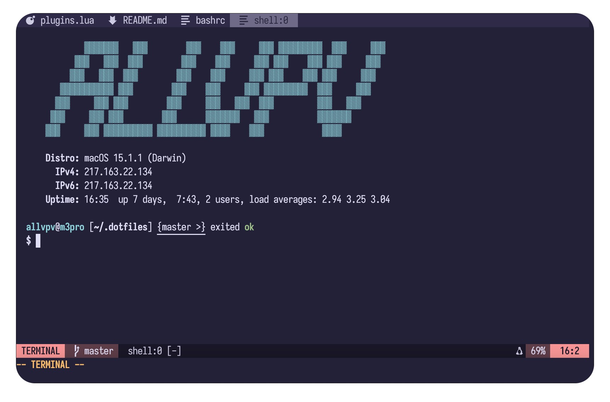

### Installation

```shell
bash -c "$(curl --proto '=https' --tlsv1.2 -sSfL https://sh.allvpv.org)"
```

### TODO

- improve multi-line history entries in `bash`
- better colors in `fzf-lua`
- some tool for `git merge`
- ad-hoc floating terminal window
- better navigation between terminal buffers
- better tool for exploring errors from LSP

### Changelog

- 2024-12-06: OSC 7 to synchronize `bash` CWD with `neovim`'s CWD
- 2024-12-06: `.bashrc` refactor
- 2024-12-06: Nuked `telescope` in favor of `fzf-lua` and `nvim-tree.lua`
